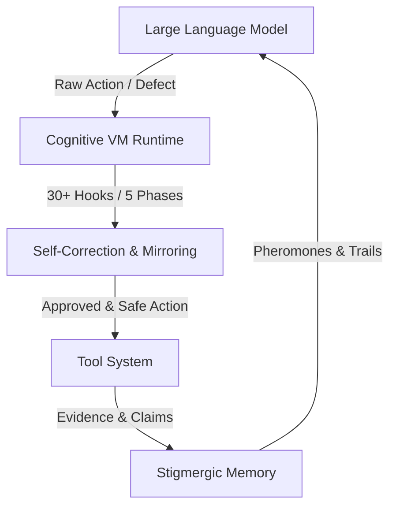

<p align="center">
  
</p>

<h1 align="center">天枢 <sub>Tianshu</sub></h1>

<p align="center">
  <b>把星辰带给每一位开发者 · Models as partners, not tools.</b>
</p>

<p align="center">
  📖 <b>English</b> · 
  <a href="README.md">🇨🇳 中文</a> · 
  <a href="docs/user-guide.md">📚 User Guide</a> · 
  <a href="docs/user-guide-sandbox-permissions.md">🛡️ Sandbox</a> · 
  <a href="docs/user-guide-provider-config.md">⚙️ Provider Config</a>
</p>

<p align="center">
  
  
  
  
</p>

---

Tianshu (天枢) is a high-performance terminal coding agent runtime featuring a robust **Cognitive Virtual Machine (CVM)**, a continuous self-perception engine, stigmergic file-based memory, and deep prefix-cache optimization (a measured steady-state **95–99% prefix-cache hit rate** on DeepSeek V4). It is designed to act as an autonomous developmental partner rather than a passive code editing utility.

> [!NOTE]
> The project was originally codenamed **Rivet**; the installed CLI binary is still
> named `rivet` for backward compatibility.

## Quick Start

### 1. Prerequisites

- **Node.js 24.1.0** (recommended; 22+ may work) — required to run Tianshu. Verify with `node --version`.
- **Git** — optional but strongly recommended. Without it Tianshu still runs (agents
  work in-place), but git unlocks delegated worktree isolation, checkpoint rollback,
  `commit`/`diff` review, and per-worker diff review. Install: <https://git-scm.com/downloads>.

### 2. Install (pick one)

**A. Desktop app (ready to use)** — download from [GitHub Releases](https://github.com/huiliyi37/Tianshu-Tui/releases/latest): macOS `.dmg` · Windows `.msi` · Linux `.AppImage`.

**B. npm global install (recommended for the CLI)** — published as `tianshu-tui`, no local build needed, with auto update checks on startup:

```bash
npm install -g tianshu-tui
rivet
```

**C. Build from source**:

```bash
git clone https://github.com/huiliyi37/Tianshu-Tui.git
cd Tianshu-Tui
npm install
npm run build      # produces dist/main.js
npm start          # or: node dist/main.js
```

### 3. Configure an API Key

```bash
# A. Environment variable (simplest for first try)
export DEEPSEEK_API_KEY=sk-xxx

# B. Persisted CLI config (saved to ~/.rivet/config.json)
rivet config set-key deepseek sk-xxx
```

> Other providers (Claude, GLM, Codex, MiniMax, MiMo) use the same pattern. See
> [Provider Config](docs/user-guide-provider-config.md).

### 4. Launch

```bash
rivet            # or: npm start / node dist/main.js
```

You should see the TUI with a `〉` prompt. Type your request and press Enter.

### Auto-Update

When installed via npm, Tianshu checks for newer versions at startup (once per 24h)
and shows a banner. `/update` runs `npm install -g tianshu-tui@latest` and restarts.
Source installs use `git pull && npm install && npm run build`. Suppress the check
with `RIVET_NO_UPDATE_CHECK=1`.

## Model Configuration

### Multi-Provider with Adaptive Routing

| Provider | Auth | Notable Models |
|----------|------|----------------|
| DeepSeek | API key | deepseek-v4-pro (1M ctx), deepseek-v4-flash |
| Claude | API key (via `cc-switch` proxy) | opus-4-7, opus-4-6, sonnet-4-5 |
| GLM (Zhipu) | API key | glm-5.2 |
| Codex (GPT-5.5) | OAuth PKCE (ChatGPT subscription) | gpt-5.5 |
| MiniMax | API key | MiniMax-M2.7 |
| MiMo | API key | mimo-v2.5-pro |

Switch providers inside a session with `/model <name>`.

```bash
rivet config                                              # interactive setup (TTY)
rivet config setup deepseek --key-env DEEPSEEK_API_KEY --default
rivet config setup codex --default                       # OAuth (browser login)
rivet config show
```

Or edit `~/.rivet/config.json` directly (only overrides needed, defaults are deep-merged):

```json
{
  "provider": {
    "default": "deepseek",
    "providers": {
      "deepseek": {
        "apiKeyEnv": "DEEPSEEK_API_KEY",
        "models": [
          { "id": "deepseek-v4-pro", "contextWindow": 1000000, "maxTokens": 384000 }
        ]
      }
    }
  },
  "agent": { "maxTurns": 50, "approval": "auto-safe", "crossSessionEnabled": true },
  "compact": { "enabled": true, "autoThreshold": 800000 }
}
```

### Worker Routing (different models for sub-agents)

```json
{
  "workers": {
    "profiles": {
      "capable": { "provider": "codex", "model": "gpt-5.5" },
      "cheap":   { "provider": "minimax", "model": "MiniMax-M2.7" }
    },
    "routing": { "code_edit": "capable", "repo_summarization": "cheap" }
  }
}
```

See [Provider Config](docs/user-guide-provider-config.md) for the full reference.

## Approval & Permissions

| Mode | Behavior |
|------|----------|
| `auto-safe` (default) | Low-risk actions auto-approve; high-risk still asks |
| `manual` | Ask whenever a tool declares approval required |
| `dangerously-skip-permissions` | Skip all interactive prompts — trusted workspaces only |

```bash
rivet config set-approval dangerously-skip-permissions
rivet --dangerously-skip-permissions   # one-session override
```

Manage permission mode and tool/bash allow-deny rules in a session with `/permission`:

```
/permission status                  # current mode + active rules
/permission mode auto-safe          # switch mode
/permission allow <tool>            # allow a tool without prompting
/permission deny <tool>             # always block a tool
/permission bash <pattern>          # allow/deny a bash command pattern
/permission reset                   # clear custom rules
```

Skipping prompts does **not** disable tool validation, path safety, evidence tracking,
checkpoints, or delivery gates. For sandbox backends, path grants, and risk
classification, see [Sandbox & Permissions](docs/user-guide-sandbox-permissions.md).

## Why Tianshu?

Most AI coding agents treat context as a garbage can—they dump everything in until it overflows, and then perform naive compression. Tianshu introduces a structured, highly optimized **Cognitive Runtime** built around the concept of a **Cognitive Virtual Machine (CVM)** and **Prefix-Cache-Friendly** optimization.



### The Three Pillars of Tianshu's Architecture

1. **Cognitive Virtual Machine (CVM)**:
   A dedicated virtual runtime layer implementing `30+ conditionally-assembled hooks` across `5 runtime phases` (pre-turn, after-perception, post-tool, post-turn, post-session). CVM traps and emulates LLM behavior at runtime, actively correcting alignment drift, attention decay, and loop oscillations without modifying model weights.
2. **Stigmergic Memory**:
   Unlike static memory files, Tianshu implements a biology-inspired stigmergic memory system. It leaves behavioral "pheromones" directly mapped onto codebase files that decay naturally over time. The agent gets faster and smarter on files it modifies frequently.
3. **Prefix-Cache Optimization**:
   DeepSeek V4 bills cache misses up to 50× more than cache hits. Tianshu's prompt engine is architected around prefix-cache optimization (including Ice Mirror 3-zone cache anchors and frozen-prefix matching), reaching a steady-state **95–99% cache hit rate** on long sessions and substantially cutting API cost.

### Engineering Metrics

| Metric | Value |
|--------|-------|
| TUI source (TypeScript, excl. tests) | 770 files / ~159k lines |
| Test code | 922 files / ~152k lines |
| Test cases (node:test) | **10,000+**, test : source ≈ **1 : 1** |
| Type checking | `tsc` strict + `noUncheckedIndexedAccess`, zero errors |
| Prefix-cache hit rate | 95–99% steady state, measured on long sessions |

Agent core logic (multi-turn loops, tool pipelines, context compaction) is notoriously hard to test, and most open-source agents ship with thin coverage. This project maintains a near 1:1 test-to-source ratio, and every incident fix ships with a regression test. Full methodology and reproduction commands: [Engineering Metrics](docs/engineering-metrics.md).

### Tianshu vs. MiMo-Code vs. Claude Code

> The table reflects each project's publicly documented focus at the time of writing. "—" means the capability is not a publicly highlighted feature, not necessarily that it is absent. Corrections welcome via issue/PR.

| Dimension | Tianshu | MiMo-Code | Claude Code |
| :--- | :--- | :--- | :--- |
| **Core focus** | Cognitive runtime (CVM) | Product experience / ecosystem | Enterprise coding agent |
| **Runtime hook layer** | 30+ conditionally-assembled hooks × 5 phases | standard agent loop | user-configurable hooks |
| **Prefix-cache tuning** | Deeply tuned for DeepSeek V4 (95–99% steady-state) | provider default | Anthropic prompt caching |
| **Self-perception** | Continuous cognitive-state vector | — | — |
| **Cross-session memory** | File-level stigmergic pheromones (auto-decay) | SQLite + MEMORY.md | project memory |
| **Multi-agent** | Concurrent worker sessions + conflict lock | background execution | remote isolated sandbox |
| **Verification gate** | Built-in delivery gate | — | — |
| **License** | Apache 2.0 | MIT | Closed source |

## Core Features

### Prefix Cache Engine

DeepSeek charges 50× more for cache misses. Tianshu's prompt engine is built around prefix-cache friendliness:

- **Frozen prefix** — System prompt + tool definitions + stable context are frozen at session start and never rewritten. DeepSeek's exact-prefix cache hits on every subsequent request.
- **Delta appendix** — Dynamic context (progress, advisories, signals) is injected as a cross-turn diff append-only block, never rewriting prior messages. Turn-to-turn delta is ~200 bytes vs ~5KB full rewrite.
- **Read-ref dedup** — Repeated reads of unchanged files return a compact reference instead of re-emitting full content.
- **Cache-aware compaction** — Compaction preserves the first 2 messages as cache anchor.
- **Diagnostics** — `/debug cache` shows hit rate, miss reason analysis, and per-turn cache history.

Real-world hit rate: 95–99% steady state on long sessions.

### Subagent Orchestration

Delegate sub-tasks to independent headless worker sessions:

- **Typed work orders** — code_search, review, verify, patch_proposal, plan
- **Tool isolation** — read-only workers (scout) vs write workers (patcher)
- **Adaptive model routing** — Per-profile pass-rate + latency scoring auto-selects the best model per task type
- **Batch dispatch** — Multiple work orders run concurrently with 5 aggregation policies
- **Team orchestration** — Plan → wave-based parallel execution with file-conflict-aware scheduling

### Goal-Driven Auto-Continue

```
/goal Refactor the authentication module to use async/await throughout
/cancel-goal   # stop early
```

GoalTracker integrates with the turn loop, doom-loop detection, and delivery gates.

### Rewind

Double-tap **ESC** to open message history. Select any past user message to rewind the conversation to that point — agent state, tool history, and session metadata roll back cleanly. Available in both TUI and desktop.

### Council (Multi-Perspective Review)

```
/council <objective>
/council <objective> --rounds 2   # enable rebuttal round
```

Convenes multiple expert seats to review a plan or design, producing an auditable Markdown plan with seat contributions and convergence state.

### Star Domains

Tianshu models different cognitive stances as **star domains**. Each domain is not a role-play costume but a switchable cognitive discipline: when active, the system prompt, tool whitelist, and decision threshold are tuned to that domain's methodology. Switch explicitly or let Tianshu route automatically from the task description.

```bash
/domain tianliang          # switch to Tianliang (execution/delivery)
/domain list               # list all domains
/domain                    # open the domain picker
Implement user registration  # auto-routes to Tianliang
Review this design           # auto-routes to Tianquan
```

| Domain | ID | Role | Motto |
|--------|-----|------|-------|
| 天枢 Tianshu | `tianshu` | Default orchestrator; closes the loop from understanding to delivery | 执中调度，以全貌定向 |
| 破军 Pojun | `pojun` | Exploration, experimentation, breaking boundaries | 好男儿当负三尺剑立不世之功 |
| 天府 Tianfu | `tianfu` | Guardianship, refactoring, optimization, stability | 善守者，藏于九地之下 |
| 天梁 Tianliang | `tianliang` | Execution, wave-based delivery, precise closure | 千里之行，始于足下 |
| 天权 Tianquan | `tianquan` | Architecture review, planning, trade-offs | 权衡取舍，择善而从 |
| 天机 Tianji | `tianji` | Challenge assumptions, find boundary gaps, deduce failure modes | 运筹帷幄之中，决胜千里之外 |
| 天璇 Tianxuan | `tianxuan` | Cross-domain pattern discovery, retrospectives | 道可道，非常道 |
| 辅 Fu | `fu` | Cognitive-field distillation, prompt tuning | 蒸馏不是创造新东西，是让已有的东西第一次被看清 |
| 文曲 Wenqu | `wenqu` | Code aesthetics, naming, elegant structure | 形随意转，美自境生 |
| 瑶光 Yaoguang | `yaoguang` | Reproduction, defect taxonomy, silence audit | 绿非证明，复现即证 |
| 华盖 Huagai | `huagai` | Long-haul construction, baseline-first endurance | 守昼托举，长路不弃 |

Each star has a seed-capsule capturing its field-tested methodology; see `docs/seed-capsule-*.md`. Council (`/council`) and team mode (`/team`) automatically convene multiple star-domain seats and can enter a rebuttal round when opinions conflict.

### Skills System

Reusable workflow playbooks loaded from `.rivet/skills/*.md`. Two-layer progressive disclosure: only name + description enters context; full instructions load on demand via the `skill` tool or `/skill`.

| Skill | Description |
|-------|-------------|
| `writing-plans` | Structured plan writing with Mermaid diagrams, spec sections, verification plan |
| `executing-plans` | Task graph decomposition, wave-by-wave execution, verification at each wave |
| `subagent-driven-development` | Delegate complex tasks with typed profiles, batch dispatch, parallel workers |
| `agent-harness-testing` | TDD feasibility probes, test scaffolding, red-green-refactor workflow |
| `research-spec` | Research + spec workflow: exploration → condition matrix → counterexample table |

```
/skill writing-plans                # load and immediately run the skill protocol
/skill writing-plans <your task>    # load skill and pass an initial task
/skill off writing-plans            # stop re-injecting the skill instructions
```

Create a custom skill by dropping a `.md` file with YAML frontmatter (`name`, `description`, `triggers`) into `.rivet/skills/`.

### Cross-Session Knowledge

| Source | Content |
|--------|---------|
| `.rivet/knowledge/memory.jsonl` | Project rules, debugging heuristics, architecture conventions |
| `.rivet/sessions/<id>/pheromones.json` | Cross-session signals |
| `.rivet/presence.json` | Companion agent awareness |

Toggle via `agent.crossSessionEnabled`. Force-off: `RIVET_NO_CROSS_SESSION=1`.

### MCP (Model Context Protocol)

Connect external tool servers — documentation search, databases, APIs — directly into the agent's tool pipeline. MCP servers auto-discover at startup; their tools appear as `mcp__<serverId>__<toolName>`.

```bash
rivet config mcp add-stdio <server-id> npx -y <package> [args...]   # local process
rivet config mcp add-sse <server-id> http://localhost:3001/sse      # remote/network
rivet config mcp add-preset context7                                # popular preset
rivet config mcp list                                               # list + status
```

Inside a session: `/mcp` (status) and `/debug mcp` (diagnostics). MCP tools respect the same approval mode as built-in tools.

## Slash Commands

| Command | Description |
|---------|-------------|
| `/help` | Show available commands |
| `/model [name\|list]` | Show or switch model/provider |
| `/goal <text>` | Set autonomous goal; runs until done |
| `/cancel-goal` | Stop goal execution |
| `/plan` | Enter plan mode (design-first, approval-gated) |
| `/council <text>` | Convene multi-expert review |
| `/compact` | Compact context now |
| `/context` | Show context ledger: health, tokens, rounds, claims |
| `/evidence` | Show evidence summary (files read/modified, tests) |
| `/rollback` | Preview/restore git checkpoint (`confirm` to execute) |
| `/undo` | Undo last file change (preview, `confirm` to restore) |
| `/rewind` | Double-ESC: rewind to a past user message |
| `/sessions` `/resume <n>` | List/restore saved sessions (restores side panel, todos, active plan) |
| `/effort [off\|low\|medium\|high\|max]` | Control reasoning depth |
| `/theme [name\|list]` | Switch color theme |
| `/permission [status\|mode\|allow\|deny\|bash\|remove\|reset\|test]` | Manage permission mode and tool/bash allow-deny rules |
| `/skill <name>` | Load and immediately invoke a skill |
| `/skill off <name>` | Stop re-injecting an invoked skill |
| `/debug [prompt\|cache\|mcp]` | Debug prompt, cache stats, or MCP |
| `/mcp` | MCP server connection status |
| `/memory <text>` | Save session memory entry |
| `/update` | Check for and install updates (npm) |
| `/exit` `/quit` | Save session and exit |

## For Developers

### Tech Stack

Node.js 22 · TypeScript strict (`noUncheckedIndexedAccess`) · T9 ANSI rendering engine · tsup bundle · node:test + assert/strict

### Build & Test

```bash
npx tsc --noEmit                                    # typecheck
npm test                                             # all tests (10,000+ cases)
npm run build                                        # tsup bundle
node dist/main.js                                    # launch TUI
node dist/main.js -p "fix the typo"                  # headless mode
```

### Extending

**Add a tool** — implement `ToolDefinition` + executor in `src/tools/`, register in `src/main.tsx`, add test in `src/tools/__tests__/`.

**Add a skill** — drop a `.md` file in `.rivet/skills/` with frontmatter (`name`, `description`, `triggers`).

**Add a slash command** — project-local `.rivet/commands/*.md` with `$ARGUMENTS` interpolation.

**Add a hook** — implement `PreToolUse | PostToolUse | UserPromptSubmit | PreCompact` handler, register via `HookRegistry`. Handlers are isolated — a broken hook never crashes the loop.

### Architecture

```
src/
├── agent/     Core loop: turn-orchestrator, tool pipeline, coordinator,
│              advisory-bus, goal-tracker, sensorium, immune system
├── api/       Streaming API client — DeepSeek, GLM, Codex OAuth, multi-provider routing
├── prompt/    Prompt engine — frozen prefix + delta appendix + volatile context layers
├── tools/     Tools — bash, edit, read/write, grep, glob, run_tests, git, delegate, ...
├── tui/       Terminal UI (T9 ANSI engine: scrollback, input controller, overlay, stream)
├── compact/   Three-layer semantic pruning + micro-compact + request-time collapse
├── context/   Context ledger, progressive compaction, claim system, anchor registry
├── config/    Zod-validated config: defaults → ~/.rivet → project overlay
├── server/    Desktop sidecar: session management, REST routes, SSE streaming
├── mcp/       Model Context Protocol client (stdio + SSE)
├── lsp/       Language Server Protocol integration
└── search/    Semantic search (BM25 + embedding RRF fusion)
```

### Session Data

Session logs are stored outside the project under `~/.rivet/sessions/<project-slug>/`
(slug = dir name + cwd hash prefix), keeping them invisible to `glob`/`grep` and out
of the working tree. Override with `RIVET_SESSION_DIR`. Global config lives at
`~/.rivet/config.json`. Each launch gets a unique session ID, so multiple instances
run in parallel without interference.

## Safety

- **Path boundary enforcement** — glob/grep/diff reject `..` traversal; `validatePath` blocks escapes
- **Symlink cycle protection** — realpath + visited set
- **SSRF protection** — Per-hop DNS + private IP blocking on every redirect
- **Sensitive file rejection** — `.env`, `credentials.*`, `*key*`, `*token*` blocked from read/commit
- **Destructive command gate** — `rm -rf`, force push, `DROP/TRUNCATE` require explicit confirmation
- **Checkpoint + rollback** — Git checkpoint before first file modification each turn
- **File-level undo** — Versioned backups before every write/edit
- **Worker safety** — Timeout budget via AbortController, tool allowlist enforcement

## 🤝 Community & Support

- **Usage questions / discussions** → [GitHub Discussions](https://github.com/huiliyi37/Tianshu-Tui/discussions)
- **Bug reports / feature requests** → [GitHub Issues](https://github.com/huiliyi37/Tianshu-Tui/issues)
- **Security vulnerabilities** → [Report privately](https://github.com/huiliyi37/Tianshu-Tui/security/advisories/new) (do not open a public issue)
- **Contributing** → See [CONTRIBUTING.md](CONTRIBUTING.md)
- **Support guide** → See [SUPPORT.md](SUPPORT.md)

> Note: a maintainer needs to enable Discussions in `Settings → General → Discussions` first.

## ☕ Support

If Tianshu has been useful and you'd like to say thanks, you can. It stays a coffee, not a contract — donations don't buy feature priority or change how issues get triaged.

- **China mainland** — WeChat Pay (scan the QR code below)


## License

Licensed under the [Apache License, Version 2.0](LICENSE). Copyright 2025-2026 Tianshu Contributors.
