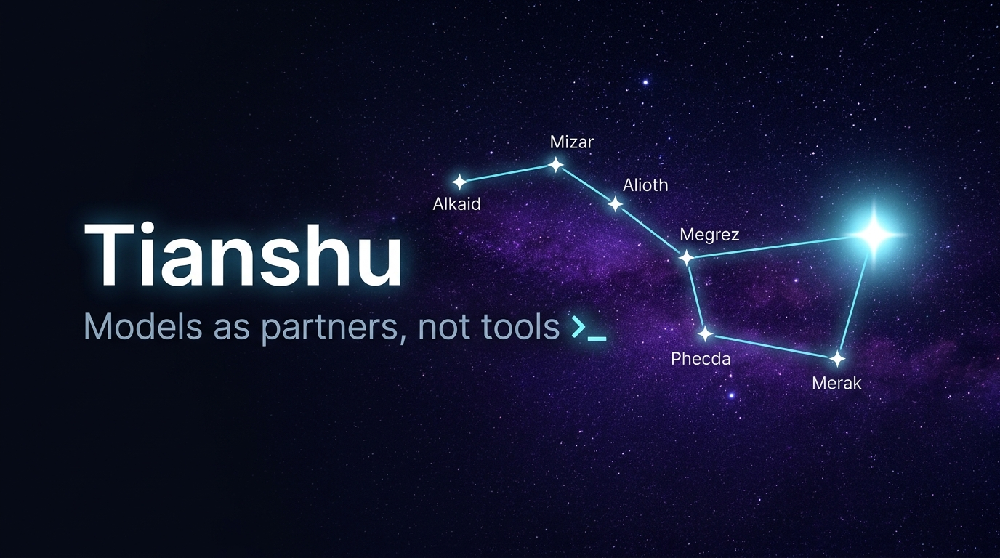
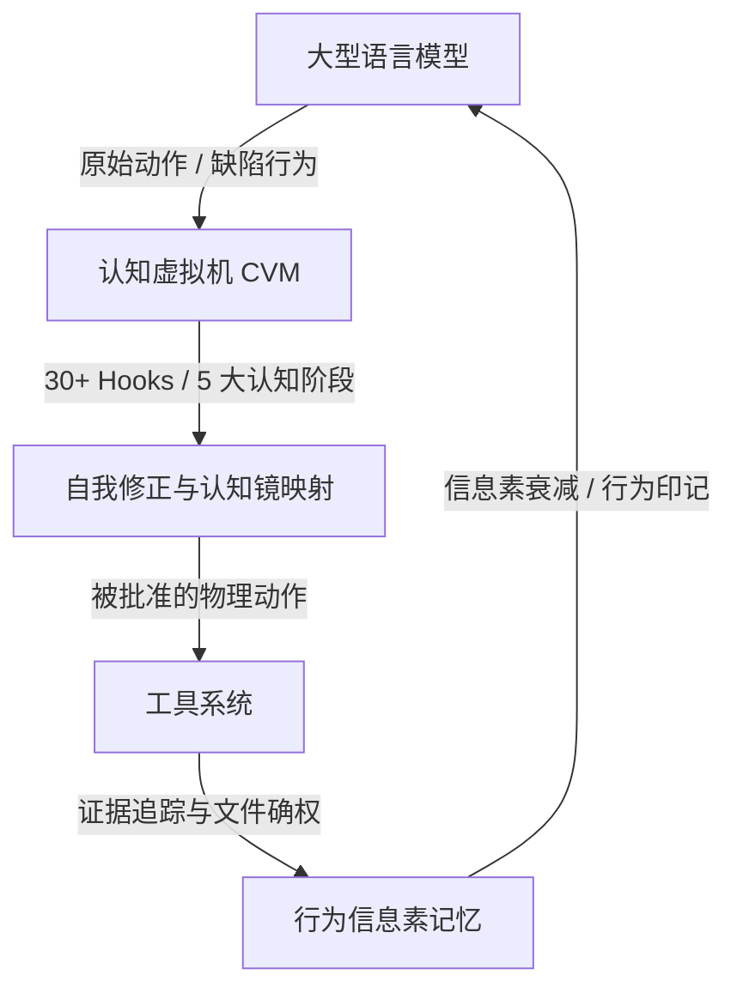

<p align="center">
  
</p>

<h1 align="center">天枢 <sub>Tianshu</sub></h1>

<p align="center">
  <b>把星辰带给每一位开发者 · Models as partners, not tools.</b>
</p>

<p align="center">
  🇨🇳 <b>中文</b> · 
  <a href="README.en.md">📖 English</a> · 
  <a href="docs/user-guide.md">📚 用户手册</a> · 
  <a href="docs/user-guide-sandbox-permissions.md">🛡️ 沙箱权限</a> · 
  <a href="docs/user-guide-provider-config.md">⚙️ 模型配置</a>
</p>

<p align="center">
  
  
  
  
</p>

---

**天枢 (Tianshu)** 是一个全功能、高性能的终端编程智能体运行时（TUI）。它跳出了传统 AI 编程助手把大模型仅当成“工具”的局限，基于**认知虚拟机 (CVM)**、**自感知层**和**信息素（Stigmergy）自衰减记忆**构建，让 AI 成为有独立判断与认知防护的“开发伙伴”。同时针对 DeepSeek V4 做了前缀缓存工程优化（长会话实测稳态**命中率 95–99%**）。

> [!NOTE]
> 本项目最初的开发代号为 **Rivet**；为保持向后兼容，已安装的 CLI 命令名仍为 `rivet`。

## 🚀 快速开始

### 1. 环境要求

- **Node.js 24.1.0**（推荐；22+ 通常可用）—— 用 `node --version` 检查。
- **Git**（强烈建议）—— 可选。没有它天枢仍可运行（就地修改），但 git 能解锁：委派 worktree 隔离、检查点回滚、`commit`/`diff` 审查、每个 worker 的 diff 审查。安装：<https://git-scm.com/downloads>。

### 2. 安装（任选其一）

**方式 A：桌面端（开箱即用）** —— 从 [GitHub Releases](https://github.com/huiliyi37/Tianshu-Tui/releases/latest) 下载：macOS `.dmg` · Windows `.msi` · Linux `.AppImage`。

**方式 B：npm 全局安装（推荐，使用命令行）** —— 已发布为 `tianshu-tui`，无需本地构建，且每次启动自动检查更新：

```bash
npm install -g tianshu-tui
rivet
```

**方式 C：从源码构建**：

```bash
git clone https://github.com/huiliyi37/Tianshu-Tui.git
cd Tianshu-Tui
npm install
npm run build      # 生成 dist/main.js
npm start          # 或：node dist/main.js
```

### 3. 配置 API Key（首次必做）

```bash
# A. 环境变量（首次试用最简单）
export DEEPSEEK_API_KEY=sk-xxx

# B. 持久化 CLI 配置（保存到 ~/.rivet/config.json）
rivet config set-key deepseek sk-xxx
```

> 其他提供商（Claude、GLM、Codex、MiniMax、MiMo）用法相同，详见 [模型配置](docs/user-guide-provider-config.md)。

### 4. 启动

```bash
rivet            # 或：npm start / node dist/main.js
```

你会看到带有 `〉` 提示符的 TUI。输入需求后按回车即可。

### 无界面模式（脚本集成）

```bash
rivet -p "解释 src/agent/loop.ts"       # 单次提示，文本输出，无 TUI
rivet -p "列出所有 TODO 注释" --json    # JSON 输出，便于脚本处理
```

### 自动更新

通过 npm 安装时，天枢每 24 小时在启动时检查新版本并弹出提示。`/update` 会执行 `npm install -g tianshu-tui@latest` 并重启；源码安装则用 `git pull && npm install && npm run build`。用 `RIVET_NO_UPDATE_CHECK=1` 可关闭检查。

## ⚙️ 模型配置

### 多提供商 + 自适应路由

| 提供商 | 认证方式 | 旗舰模型 |
|--------|----------|----------|
| DeepSeek | API key | deepseek-v4-pro (1M ctx), deepseek-v4-flash |
| Claude | API key（通过 `cc-switch` 代理） | opus-4-7, opus-4-6, sonnet-4-5 |
| GLM（智谱） | API key | glm-5.2 |
| Codex (GPT-5.5) | OAuth PKCE（ChatGPT 订阅） | gpt-5.5 |
| MiniMax | API key | MiniMax-M2.7 |
| MiMo | API key | mimo-v2.5-pro |

会话内用 `/model <name>` 随时切换提供商。

```bash
rivet config                                              # 交互式设置（TTY）
rivet config setup deepseek --key-env DEEPSEEK_API_KEY --default
rivet config setup codex --default                       # OAuth（首次浏览器登录）
rivet config show                                         # 查看完整配置
```

也可直接编辑 `~/.rivet/config.json`（只写需要覆盖的字段，默认值会深度合并）：

```json
{
  "provider": {
    "default": "deepseek",
    "providers": {
      "deepseek": {
        "apiKeyEnv": "DEEPSEEK_API_KEY",
        "models": [
          { "id": "deepseek-v4-pro", "contextWindow": 1000000, "maxTokens": 384000 }
        ]
      }
    }
  },
  "agent": { "maxTurns": 200, "approval": "auto-safe", "crossSessionEnabled": true },
  "compact": { "enabled": true, "autoThreshold": 800000 }
}
```

### Worker 路由（子智能体用不同模型）

```json
{
  "workers": {
    "profiles": {
      "capable": { "provider": "codex", "model": "gpt-5.5" },
      "cheap":   { "provider": "minimax", "model": "MiniMax-M2.7" }
    },
    "routing": { "code_edit": "capable", "repo_summarization": "cheap" }
  }
}
```

完整说明见 [模型配置指南](docs/user-guide-provider-config.md)。

## 🔐 权限模式

三档统一入口，所有模式通过 `/permission` 管理：

| 模式 | 命令 | 行为 |
|------|------|------|
| **Manual** | `/permission manual` | 每个高风险工具都弹确认。最大控制，适合敏感项目。 |
| **Auto**（默认） | `/permission auto [轮次]` | 低/无风险工具自动执行，高风险仍确认。可配每 N 轮暂停检查点（`/permission auto 20`），默认关闭。 |
| **YOLO** | `/permission yolo confirm` | 全自动执行，无刹车无打扰。回滚兜底（`/rollback` + git 检查点）。需二次确认。 |

> **Windows 注意**：Windows 原生无文件系统沙箱。天枢桌面版安装包内嵌 PortableGit（完整 Git + Git Bash，开箱即用，不依赖用户自装 Git for Windows；已装系统 Git 时优先用系统版）。无沙箱环境下，安全写命令在 Auto 模式自动放行，风险写（rm/mv/git 写操作）仍需审批。

```bash
rivet config set-approval dangerously-skip-permissions  # 启动即 YOLO
rivet --dangerously-skip-permissions                    # 单次会话 YOLO
```

会话内用 `/permission` 管理：

```
/permission                    # 查看当前模式与规则
/permission manual             # 切 Manual
/permission auto [轮次]        # 切 Auto，可选检查点间隔（0=关）
/permission yolo confirm       # 切 YOLO（需二次确认）
/permission allow <tool>       # 白名单工具
/permission deny <tool>        # 黑名单工具
/permission bash allow <前缀>  # bash 命令白名单
/permission reset               # 清空自定义规则
```

**Auto 检查点**：在 Auto 模式下，可设置每 N 轮暂停并同步进度摘要（改了哪些文件 / token 用量），确认方向后继续。桌面端设置面板可直接配置。

跳过提示**不会**禁用工具验证、路径安全、证据追踪、检查点和交付门禁。沙箱后端、路径授权、风险分级详见 [沙箱与权限](docs/user-guide-sandbox-permissions.md)。

## 💡 为什么做天枢

大多数 AI 编程助手把上下文当作桶——装满就溢出，然后盲目压缩。天枢引入了围绕**认知虚拟机 (CVM)**与**前缀缓存友好 (Prefix-Cache-Friendly)**设计的结构化、高性能**认知运行时**。



### 三大核心架构支柱

1. **认知虚拟机 (CVM)** —— 天枢在运行时建立了一个独立的虚拟层，横跨 `5 大运行时阶段`（preTurn 回合前、afterPerception 感知后、postTool 工具后、postTurn 回合后、postSession 会话后），并按需条件装配 `30+ 个生命周期 Hook`。CVM 在不改变模型权重的前提下，主动拦截并纠正大模型的服从性漂移、注意力衰减和重复工具调用的 Doom Loop。
2. **生物启发式信息素记忆 (Stigmergy)** —— 区别于静态记忆文件（如 MEMORY.md），天枢基于生物学“化学信息素”机制，将行为足迹和认知标记直接映射在代码文件上，并随时间自动衰减。AI 在修改频繁的文件上会越用越熟。
3. **前缀缓存优化** —— DeepSeek V4 对缓存未命中按命中的至多 50 倍计费。天枢的提示词引擎围绕前缀缓存友好（冰镜三区缓存锚点、冻结系统提示词等）重构，长会话稳态命中率 **95–99%**，显著降低 API 成本。

## ✨ 核心特性

### 前缀缓存引擎

DeepSeek 对缓存未命中收取 50× 费用。天枢的提示词引擎围绕前缀缓存友好构建：

- **冻结前缀** —— 系统提示词 + 工具定义 + 稳定上下文在会话开始时被冻结，永不重写，后续每次请求都命中缓存。
- **增量附录** —— 动态上下文（进度、advisories、信号）以跨回合 diff 追加块注入，永不重写历史。回合间增量约 200 字节 vs ~5KB 全量重写。
- **Read-ref 去重** —— 对未变化文件的重复读取返回紧凑引用，而非重发完整内容。
- **缓存感知压缩** —— 压缩保留前 2 条消息作为缓存锚点。
- **诊断** —— `/debug cache` 显示命中率、未命中原因分析、每回合缓存历史。

实战命中率：长会话稳态 95–99%。

### 子智能体编排

将子任务委派给独立的无界面 worker 会话：

- **类型化 work order** —— code_search、review、verify、patch_proposal、plan
- **工具隔离** —— 只读 worker（scout）vs 写 worker（patcher）
- **自适应模型路由** —— 按 profile 的通过率 + 延迟评分，自动为每类任务选最优模型
- **批量调度** —— 多个 work order 并发执行，5 种聚合策略
- **团队编排** —— Plan → 按 wave 并行执行，带文件冲突感知调度

### 目标驱动的自动续跑

```
/goal 重构认证模块，全面使用 async/await
/cancel-goal   # 提前停止
```

GoalTracker 与回合循环、doom-loop 检测、交付门禁集成；goal 模式下放宽 doom-loop 阈值以允许更深探索。

### Plan Mode（计划模式）

设计优先的开发工作流——先出计划再动手，避免"上来就改代码"的冲动派陷阱。

```
/plan 实现用户登录模块，支持 JWT + refresh token
```

进入 Plan Mode 后，agent 不会立即修改代码，而是：
1. **调研** —— 读取相关代码、理解现有架构和约束
2. **生成方案** —— 产出结构化计划文档（技术调研、架构图、任务拆解、验证方案），写入 `.rivet/plans/<slug>.md`
3. **提交审批** —— 列出方案要点和备选路径，等待你的确认
4. **分波执行** —— 批准后自动按 wave 并行执行，每波过审查门禁

```
/plan                      # 列出所有已生成计划
/plan close <file>         # 关闭已完成计划（标记任务状态）
/plan close <file> --preview  # 预览关闭影响，不实际写入
/plan-template             # 管理可复用计划模板
```

Plan Mode 内置星域委派——复杂计划自动调用 `delegate_task` 从不同架构视角（天权/瑶光/天机/天府/天璇）并行探查，产出的 findings 标注"待核验"以防盲信。桌面端在 plan 执行时展示 checklist 实时进度（待办项面板随波次推进自动勾选）。

### 倒带（Rewind）

随时双击 **ESC** 打开消息历史，选择任一过往用户消息，将会话干净地倒带到该点——agent 状态、工具历史、会话元数据一并回滚。TUI 与桌面端均可用。

### 委员会（多视角审查）

```
/council <目标>
/council <目标> --rounds 2   # 启用反驳轮次
```

召集多个专家席位审查计划或设计，冲突时可选第二轮反驳，产出可审计的 Markdown 计划。

### Skills 系统

可复用的工作流剧本，从 `.rivet/skills/*.md` 加载。两层渐进披露：只有名称 + 描述进入上下文，完整指令按需通过 `skill` 工具或 `/skill` 加载。

| Skill | 说明 |
|-------|------|
| `writing-plans` | 结构化计划写作，含 Mermaid 图、spec 段落、验证计划 |
| `executing-plans` | 任务图分解，按 wave 执行，每 wave 验证 |
| `subagent-driven-development` | 委派复杂任务，类型化 profile、批量调度、并行 worker |
| `agent-harness-testing` | TDD 可行性探针、测试脚手架、red-green-refactor |
| `research-spec` | 研究 + spec 工作流：探索 → 条件矩阵 → 反证表 |

```
/skill writing-plans                # 加载并立即执行该 skill
/skill writing-plans <你的任务>     # 加载并传入初始任务
/skill off writing-plans            # 停止重复注入该 skill
```

也可在 `.rivet/skills/` 放一个带 YAML frontmatter（`name`、`description`、`triggers`）的 `.md` 自定义 skill。

### 跨会话知识

| 来源 | 内容 |
|------|------|
| `.rivet/knowledge/memory.jsonl` | 项目规则、调试启发式、架构约定 |
| `.rivet/sessions/<id>/pheromones.json` | 跨会话信号 |
| `.rivet/presence.json` | 伴生 agent 感知 |

通过 `agent.crossSessionEnabled` 切换，强制关闭：`RIVET_NO_CROSS_SESSION=1`。

### MCP（Model Context Protocol）

把外部工具服务器——文档搜索、数据库、API——直接接入 agent 的工具流水线，启动时自动发现，工具以 `mcp__<serverId>__<toolName>` 形式出现。

```bash
rivet config mcp add-stdio <server-id> npx -y <package> [args...]   # 本地进程
rivet config mcp add-sse <server-id> http://localhost:3001/sse      # 远程/网络
rivet config mcp add-preset context7                               # 常用预设
rivet config mcp list                                              # 列出 + 状态
```

会话内：`/mcp`（状态）、`/debug mcp`（诊断）。MCP 工具与内置工具遵循同一审批模式。

### 桌面端（Tauri）

桌面端在 TUI 的全部能力之上，提供了可视化交互层：

- **+ 菜单**：议事会 ♟、团队模式 ⬡、派子代理、模型切换、星域选择一键触达（不再需要手敲 slash 命令）
- **推理强度选择器**：`/effort`（无参数）弹出交互面板，上下选档位（Auto/Max/High/Medium/Low/Off），回车确认
- **思考计时器**：agent 执行时显示实时 elapsed（如 "思考中 · explore · 1m 23s"），超过 10 分钟变红提示可能卡住
- **@file 文件预览**：消息中提及的文件可点击，右侧抽屉展示文件内容（语法高亮 + 行号）
- **DeepSeek 余额查询**：Insights 面板顶部显示账户余额和欠费状态（调官方 API）
- **自定义 Provider**：设置 → 连接模型服务商 → + 自定义 Provider，支持任意 OpenAI 兼容端点（Ollama/vLLM/直连 OpenAI），API Key 可选
- **watchdog 自动恢复**：边界停滞时自动续跑，桌面端时间线可见恢复事件（⟳ 自动恢复 / ⏹ 配额耗尽）
- **多会话并发**：标签栏管理多个会话，独立 cwd + 模型 + 审批模式

## ⌨️ 斜杠命令

| 命令 | 说明 |
|------|------|
| `/help` | 显示可用命令 |
| `/model [name\|list]` | 显示或切换模型/提供商 |
| `/goal <text>` | 设置自主目标，运行到完成 |
| `/cancel-goal` | 停止目标执行 |
| `/plan` | 进入计划模式（设计优先，审批门禁） |
| `/council <text>` | 召集多模型议事会审查（天权/天府/天璇三席） |
| `/team <plan.md>` | 团队模式：多 agent 并行执行计划 |
| `/compact` | 立即压缩上下文 |
| `/context` | 显示上下文账本：健康度、tokens、回合、声明 |
| `/evidence` | 显示证据摘要（读取/修改的文件、测试） |
| `/rollback` | 预览/恢复 git 检查点（`confirm` 执行） |
| `/undo` | 撤销上次文件变更（预览，`confirm` 恢复） |
| `/rewind` | 双击 ESC：倒带到过往用户消息 |
| `/sessions` `/resume <n>` | 列出/恢复已保存会话（恢复侧栏、待办、活动计划） |
| `/effort [off\|low\|medium\|high\|max\|auto]` | 控制推理深度（无参数弹出选择面板） |
| `/theme [name\|list]` | 切换色彩主题 |
| `/permission [manual\|auto\|yolo\|allow\|deny\|bash\|remove\|reset\|test]` | 权限模式：Manual / Auto / YOLO 三档统一 |
| `/skill <name>` | 加载并立即执行一个 skill |
| `/skill off <name>` | 停止重复注入某个 skill |
| `/debug [prompt\|cache\|mcp]` | 调试 prompt、缓存统计或 MCP |
| `/mcp` | MCP 服务器连接状态 |
| `/memory <text>` | 保存会话记忆条目 |
| `/update` | 检查并安装更新（npm） |
| `/exit` `/quit` | 保存会话并退出 |

双击 **ESC** 打开倒带覆盖层，按 **Esc** 关闭任意覆盖层。

## 🛠️ 面向开发者

### 技术栈

Node.js 22 · TypeScript strict（`noUncheckedIndexedAccess`）· T9 ANSI 渲染引擎 · tsup 打包 · node:test + assert/strict

### 构建与测试

```bash
npx tsc --noEmit                                    # 类型检查
npm exec -- tsx --test src/**/__tests__/*.test.ts   # 所有测试（2700+）
npm run build                                        # tsup 打包
node dist/main.js                                    # 启动 TUI
node dist/main.js -p "fix the typo"                  # 无界面模式
```

### 扩展

- **添加工具** —— 在 `src/tools/` 实现 `ToolDefinition` + executor，在 `src/main.tsx` 注册，在 `src/tools/__tests__/` 加测试。
- **添加 skill** —— 在 `.rivet/skills/` 放一个带 frontmatter（`name`、`description`、`triggers`）的 `.md`。
- **添加斜杠命令** —— 项目级 `.rivet/commands/*.md`，支持 `$ARGUMENTS` 插值。
- **添加 hook** —— 实现 `PreToolUse | PostToolUse | UserPromptSubmit | PreCompact` 处理器，通过 `HookRegistry` 注册；处理器相互隔离，单个坏 hook 不会让循环崩溃。
- **项目指令** —— 在项目根放 `.rivet.md`，其内容会自动注入为项目上下文。

### 架构

```
src/
├── agent/     核心循环：turn-orchestrator、tool pipeline、coordinator、
│              advisory-bus、goal-tracker、sensorium、免疫系统
├── api/       流式 API 客户端 —— DeepSeek、GLM、Codex OAuth、多提供商路由
├── prompt/    提示词引擎 —— 冻结前缀 + 增量附录 + 易变上下文层
├── tools/     工具 —— bash、edit、read/write、grep、glob、run_tests、git、delegate…
├── tui/       终端 UI（T9 ANSI 引擎：scrollback、输入控制、覆盖层、流式渲染）
├── compact/   三层语义修剪 + 微压缩 + 请求时坍缩
├── context/   上下文账本、渐进式压缩、声明系统、锚点注册表
├── config/    Zod 验证配置：默认值 → ~/.rivet → 项目覆盖
├── server/    桌面端 sidecar：会话管理、REST 路由、SSE 流
├── mcp/       Model Context Protocol 客户端（stdio + SSE）
├── lsp/       Language Server Protocol 集成
└── search/    语义搜索（BM25 + embedding RRF 融合）
```

### 会话数据

会话日志存储在项目外的 `~/.rivet/sessions/<project-slug>/`（slug = 目录名 + cwd 哈希前缀），避免被 `glob`/`grep` 扫到、也不污染工作区。可用 `RIVET_SESSION_DIR` 覆盖。全局配置在 `~/.rivet/config.json`。每次启动得到唯一会话 ID，多个实例可并行运行互不干扰。

## 🔒 安全

- **路径边界强制** —— glob/grep/diff 拒绝 `..` 穿越；`validatePath` 阻止逃逸
- **符号链接环保护** —— realpath + 访问集
- **SSRF 保护** —— 逐跳 DNS + 私有 IP 拦截，作用于每次重定向
- **敏感文件拒绝** —— `.env`、`credentials.*`、`*key*`、`*token*` 禁止读/commit
- **破坏性命令门禁** —— `rm -rf`、force push、`DROP/TRUNCATE` 需显式确认
- **检查点 + 回滚** —— 每回合首次修改文件前创建 Git 检查点
- **文件级撤销** —— 每次写/编辑前版本化备份
- **Worker 安全** —— AbortController 超时预算，工具白名单强制

## ⚡ 关键配置速查

### 环境变量

| 变量 | 作用 |
|------|------|
| `DEEPSEEK_API_KEY` | DeepSeek API 密钥 |
| `RIVET_NO_UPDATE_CHECK=1` | 关闭启动时的自动更新检查 |
| `RIVET_NO_CROSS_SESSION=1` | 禁用跨会话知识共享 |
| `RIVET_SESSION_DIR` | 覆盖会话日志存储路径 |
| `RIVET_DEBUG_TELEMETRY` | 开启遥测快照落盘（调试用） |
| `PORTABLE_GIT_MIRROR` | 覆盖 PortableGit 下载镜像 |

### `~/.rivet/config.json` 关键字段

```json
{
  "agent": {
    "maxTurns": 200,              // 单次会话最大回合数
    "approval": "auto-safe",      // manual | auto-safe | dangerously-skip-permissions
    "crossSessionEnabled": true,  // 跨会话知识共享
    "checkpointEveryTurns": 0     // Auto 模式检查点间隔（0 = 关）
  },
  "compact": {
    "enabled": true,
    "autoThreshold": 800000       // 触发自动压缩的 token 阈值
  },
  "workers": {
    "routing": {
      "code_edit": "capable",     // 按任务类型路由到不同模型
      "repo_summarization": "cheap"
    }
  }
}
```

完整配置项及默认值见 `src/config/default.ts`。

## 📚 文档

| 文档 | 说明 |
|------|------|
| [`docs/user-guide.md`](docs/user-guide.md) | 安装、配置与使用指南 |
| [`docs/user-guide-provider-config.md`](docs/user-guide-provider-config.md) | 模型提供商配置指南 |
| [`docs/user-guide-sandbox-permissions.md`](docs/user-guide-sandbox-permissions.md) | 沙箱与权限模型完整指南 |
| [`CONTRIBUTING.md`](CONTRIBUTING.md) | 贡献指南 |
| [`config.example.json`](config.example.json) | 示例配置（含子代理/审查模型路由） |

## 许可证

本项目采用 [Apache License, Version 2.0](LICENSE) 开源许可。Copyright 2025-2026 Tianshu Contributors.
