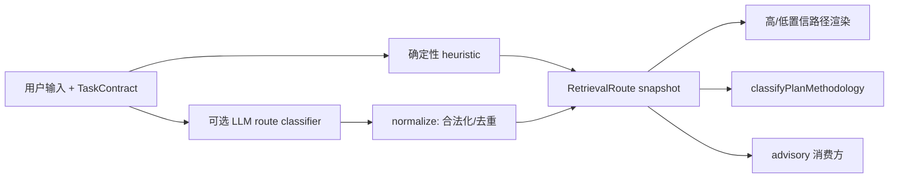

# 自适应协作流

本文档描述 RetrievalRoute 上的协作分支如何把用户任务映射到天枢的既有执行纪律。它是运行时代码的操作契约，不替代 `src/agent/intent-retrieval-route.ts` 中的确定性规则，也不允许下游重新猜测用户意图。

## 事实流



每个 turn 只建立一个 route snapshot。LLM 分支只能补充确定性分支，不能删除安全、诊断或其它由 heuristic 产生的分支。分支顺序固定为 `A → B → C → D → E`，未知值、重复值和超出上限的值在 normalize 层丢弃。

## 分支契约

| 分支 | 语义 | 触发 | 下游动作 | 计划级别 |
|---|---|---|---|---|
| A | 认知对齐 | 低置信，或命中运行时代码中明确维护的窄模糊请求信号 | 先确认目标、边界、成功标准 | advisory-only |
| B | 结构守门 | 架构/重构且存在多文件规模信号 | 先计划、核对影响面和回归 | `full` |
| C | 安全守卫 | 权限、安全、边界信号 | 先经过 fail-closed 守卫 | `full` |
| D | 诊断优先 | bug fix 或性能诊断 | 先 RED/微探针/根因，再改动 | `full` |
| E | 能力勘探 | codebase overview 且包含盘点/勘探/死代码等信号 | 复用贪狼勘探 advisory | advisory-only |

`social_idle` 是硬退位条件：不产生协作分支，不产生协作 advisory。

## 合并与低置信规则

- heuristic 分支与 LLM 分支采用集合并集；LLM 不拥有关闭确定性分支的权限。
- route 缺失或不可解析时沿用既有 heuristic fallback；不能把所有分支默认打开。
- A 分支的模糊信号以 `src/agent/collab-branches.ts` 的 `FUZZY_REQUEST_RE` 为唯一源码真相；本文档只给回归样例，不复制完整正则或扩展词表。新增“帮我弄一下/看看怎么改”等更宽泛短语前，必须同步源码、测试和本文档样例。
- 高置信 route 通过 `<collaboration-path>` 渲染分支摘要；无分支时保持旧 XML 形状，避免无意义的前缀缓存碎裂。
- 低置信 route 仍注入对齐 advisory，并保留分支摘要；`social_idle` 例外不注入。
- XML 用户内容必须 escape；理由和字段必须有长度上限。

## 消费边界

`IntentRetrievalRouteController` 保存 route snapshot，`turn-step-producer` 只消费该 snapshot：

1. `classifyTaskDepth` 使用 route task kinds；
2. `classifyPlanMethodology` 使用 route branches；B/C/D 可把执行任务升级到 `full`；A/E 不扩大计划级别；
3. advisory 消费方使用固定 key 去重；E 复用既有 `buildTanlangExplorationAdvisory` 和 `capsule-recall-tanlang` key；
4. plan submit 当前不猜测 route，也不直接执行 D gate。若未来接入，必须先扩展 `ToolCallParams` 并覆盖 TUI、server、worker 调用链。

## 反证/复现

实施或修改分支规则时，至少验证以下输入：

- `修复登录回归`：应含 D；
- `检查权限边界`：应含 C；
- 多文件架构任务：应含 B；
- `优化一下`：可含 A，但不能据此推断所有模糊短语都可执行；`帮我弄一下/看看怎么改` 这类更宽泛短语必须先有源码与测试覆盖，不能只因文档措辞被视为已支持；
- 带“盘点/死代码”的 codebase overview：应含 E；
- `你好`：task kind 为 `social_idle`，分支为空；
- LLM 返回 `C`、heuristic 返回 `D`：结果必须同时含 C、D；
- XML 内容含 `<`、`&`：输出必须 escape；
- route 无分支：输出不得凭空增加协作标签。

每个实现波次必须先写 RED 测试，再运行：

```sh
npm run typecheck
npm exec -- tsx --test src/agent/__tests__/collab-branches.test.ts
npm exec -- tsx --test src/agent/__tests__/intent-retrieval-route.test.ts
npm exec -- tsx --test src/agent/__tests__/loop-intent-retrieval-router.test.ts
```

全量交付仍需额外运行项目定义的全量测试；相关测试通过不能替代全量验证。
