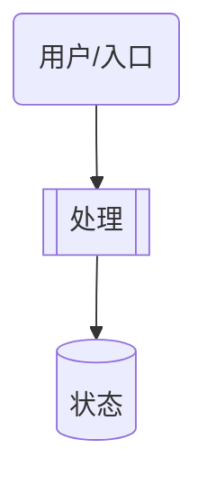

# 编写计划

## 概述

为功能需求先深入调研现有代码，理解每个拟修改函数的"为什么存在"，再设计方案并落盘。

**开始时宣布：** "我正在使用 writing-plans 技能创建实现计划。"

**与 superpowers writing-plans 的差异：**
- 天枢不依赖 `using-git-worktrees` / `finishing-a-development-branch`——改为 B1 归属门禁
- 计划阶段由主代理主导调研：核心路径自己读代码，侧支探查可派只读星域子代理并行调研

**保存路径与收尾方式（按当前模式二选一）：**
- **Plan Mode 激活时**（系统提示中有 `<plan-mode>` 块）：产出**设计文档**（不是逐步 bash/commit 菜谱）。写入**活动计划文件**（`<plan-mode>` 块中给出的路径，通常是 `.rivet/plans/draft-*.md`——这是唯一可写的文件），成熟后用 `plan action=submit` 提交等待用户批准。**不要**写 `docs/superpowers/plans/`（会被写入门禁拦截），也**不要**以 executing-plans 交接收尾。对话里只给短摘要，正文只进文件。用下方 **§3.1a 设计文档模板**。
- **独立使用时**（无 `<plan-mode>` 块）：产出可执行实现计划，保存到 `docs/superpowers/plans/YYYY-MM-DD-<slug>.md`，完成后交接给 `executing-plans` 执行。用下方 **§3.1b 可执行模板**。

## 流程

### 步骤 1：深入调研（读代码，不只读文件名）

> **原则：问题不在审查阶段，在调研深度。** 如果读得够深，计划自然不会错。

#### 1.1 读取相关代码

- 读所有相关源文件，包括工具函数和类型定义
- 读测试文件，理解现有行为边界
- 读最近的 commit message（`git log --oneline -10 -- <file>`）理解修改历史

#### 1.2 理解"为什么存在"

对计划中每个要**删除**或**修改行为**的函数，必须回答：
- 它为什么存在？（读函数注释、commit message、相关测试）
- 谁调用了它？（`grep` 调用者，列出文件:行号）
- 如果删除/修改它，有没有只有它在处理的边缘情况？

#### 1.3 检查现有实现

- 不要假设"缓冲=不好"——理解缓冲背后的逻辑
- 不要假设需要修改某个组件——先理解真正的瓶颈在哪里
- 检查是否已经有代码解决了你正要解决的问题

##### 1.3.1 水平复用扫描

当你产生"需要新建 X 模块/函数"的判断时，先做水平扫描——不沿着任务边界（要改的文件列表）往下读，而是沿着代码库的邻域关系搜索：

1. `grep` 目标功能的关键词（如 compress/collapse/fold/signature/extract）在整个 `src/` 中搜索
2. 如果命中已有函数——检查其签名是否就是你需要的，缺少的只是导出或调用连接
3. 已有实现 → 方案从"新建"收敛为"导出+连接"；无已有实现 → 新建

##### 1.3.2 全量消费方枚举

对每个拟修改/删除/导出的函数，不只沿主调用路径找消费方——`grep` 函数名，逐一列出 **所有** 调用位置的行号和上下文：

1. 列出所有调用点（文件:行号）
2. 逐一确认每个调用点的行为不会被修改破坏
3. 如果漏掉一个调用点，计划在执行时会暴露——成本远高于现在多花 30 秒 grep

##### 1.3.3 函数-调用方责任边界

当你判断"这个函数破坏了 X 纪律"时，先拆开：
- 函数本身：签名是什么？返回值是什么？有副作用吗？
- 调用方：调用方用返回值做了什么？

不要把调用链下游行为归因到纯函数。同一个纯函数在不同调用方可能产生完全不同的系统行为。

#### 1.4 调研完整性自检

完成调研后，自检：
- [ ] 已读所有相关文件（包括工具函数和类型定义）
- [ ] 已理解每个拟修改函数的存在原因
- [ ] 已 grep 所有调用者（对删除/修改操作）
- [ ] 已检查是否有现有实现已经解决问题
- [ ] 已确认边缘情况有人处理

#### 1.5 深入阅读

如果对某个函数的修改理由只有"不需要了"而没有"因为 X 已经由 Y 处理"，继续往下读：
- 用 `read_file` 直接读函数本体和所有调用方（grep 列出引用位置）
- 看 commit message（`git log --oneline -10 -- <file>`）
- 看相关测试文件理解行为边界

#### 1.6 并行星域调研（复杂任务推荐）

当任务涉及 3+ 个独立模块、跨层影响面不明、或需要多视角审视时，不要串行逐文件读——派只读星域子代理并行探查：

**何时派**：
- 需要理解 3+ 个独立模块的结构和关系时
- 不同模块的调研可以并行且互不依赖时
- 需要从特定星域视角审视代码时（如 瑶光 验测试覆盖、天权 审架构层次）

**如何派**：
- 用 `delegate_task`（单方向）或 `delegate_batch`（多方向并行），只读 profile：`code_scout` 或 `doc_scout`
- 指定 `authority` 让子代理带入该域方法论：`yaoguang`（复现验证）、`tianquan`（架构称量）、`tianji`（前提质疑）、`tianfu`（变更守护）等
- 每个子代理聚焦一个模块或一个视角，objective 写清楚要查什么
- 子代理返回的 findings 是待核验假设——定稿前用 `read_file` / `grep` 对关键结论做独立确认

**不要**：
- 不要调用 `task` / `Agent` 等非 Rivet 的子代理工具——这些是 Cursor/Claude Code 的约定，在 Rivet 中会被自动映射到 `delegate_task`。Rivet 的搜索/调研工具是 `web_search` 和 `web_fetch`，子代理工具是 `delegate_task` / `delegate_batch`
- 把主线任务本身委派给子代理（那是执行阶段的事）
- 派写入型 profile（patcher）——计划阶段只读不改文件

### 步骤 2：设计方案

#### 2.1 范围检查

- 如果功能跨越独立子系统，拆分为独立计划
- 每个计划应包含清晰的改动面（太少=不需要计划，太多=需要拆分）

#### 2.2 文件结构

列出每个要创建或修改的文件，说明其职责：
```markdown
| 文件 | 操作 | 职责 |
|------|------|------|
| `src/tools/new-tool.ts` | 创建 | 新工具实现 |
| `src/main.tsx` | 修改 | 注册新工具 |
| `src/tools/__tests__/new-tool.test.ts` | 创建 | 新工具测试 |
```

#### 2.3 调研背书

对每个"删除"或"修改行为"的操作，附上调研结果：
```markdown
**调研背书**：
- `functionA`: 调用者 3 处（file1:L10, file2:L20, file3:L30），存在原因：处理 DeepSeek 重复输出。修改后需要替代方案。
- `functionB`: 无外部调用者，仅内部使用。可安全删除。
```

没有调研背书的"删除"操作，在执行阶段会被标记为"未验证假设"。

### 步骤 3：编写计划文档

保存位置见开头「保存路径与收尾方式」。

#### 3.1a Plan Mode — 设计文档模板

> 对话禁止贴完整计划或逐步 shell/`git commit`/`npx` 菜谱。正文只进活动计划文件。

````markdown
# [功能名称] 设计

**目标：** [一句话]

**问题与根因：** [表面症状 vs 根因]

**架构：** [2-3 句 + 下方 Mermaid]



## 方案取舍（有决策时）

| 方案 | 优点 | 缺点 | 选择 |
|------|------|------|------|
| A | … | … | ✓/— |

## 改动面

| 文件 | 操作 | 提议（diff/伪代码摘要） |
|------|------|-------------------------|
| `path:line` | 修改 | … |

## 验证清单

- [ ] 场景/测试名：期望可见结果
- [ ] 人工检查点：……
（不要写逐步 bash/commit 块）

## 瑶光反证（计划期复现）

| 断言 | 证据类型 | 证据 |
|------|---------|------|
| … | 定稿后回读 | `file.ts:123` |

**待验证假设：** …

## 回归清单（重构类必填）

- [ ] 锚点 + 验证方式
````

#### 3.1b 独立使用 — 可执行模板

````markdown
# [功能名称] 实现计划

> **面向 AI 代理：** 使用 `executing-plans` 逐任务实现。
> 步骤使用复选框（`- [ ]`）语法来跟踪进度。

**目标：** [一句话描述要构建什么]

**架构：** [2-3 句话描述方案，关键设计决策及其理由]

**技术栈：** [关键技术/库]

---

## 瑶光反证（计划期复现）

> 绿非证明，复现即证。设计阶段发明的断言（"机制 X 会在时机 Y 生效"）最容易错——在这里逐条复现，不留到执行期。

**关键断言清单**：方案依赖的每条代码行为断言，附计划期证据：

| 断言 | 证据类型 | 证据 |
|------|---------|------|
| [例：块 B 在 seq=1 baseline 时不渲染] | 设计定稿后回读 | `engine.ts:1059`（[定稿后重新 read 确认]） |
| [例：修复前测试 T 失败] | run_tests RED 输出 | [命令 + 关键输出行] |

**原缺陷复现**（bugfix 类必填）：复现命令 + 观察到的 RED 输出。

**待验证假设**：计划期无法复现的推论，逐条标注 + 执行期第一步如何验证。

---

## 任务

### 任务 1：[任务名称]

- [ ] 创建 `exact/path/to/new-file.ts`
- [ ] 修改 `exact/path/to/existing-file.ts:line-range`
- [ ] 测试 `exact/path/to/test.test.ts`

**目标：** [这个任务完成什么]

**调研背书：**（如涉及删除/修改行为）
- `functionX`: [调用者、存在原因、风险]

**实现：**
```typescript
// 具体代码或精确的编辑描述
```

**验证：**
```bash
npx tsc --noEmit  # typecheck
npm exec -- tsx --test src/path/to/test.test.ts  # 期望全部通过
```

**提交：**
```bash
git add <files>
git commit -m "feat(scope): 描述（任务 N/M）"
```

### 任务 2：[任务名称]
...
````

#### 3.2 要求

**Plan Mode（3.1a）：**
- 设计文档骨架完整；验证用清单；禁止逐步 bash/commit 菜谱
- 每个改动含 file:line 与提议 diff/伪代码
- 含瑶光反证；重构类含回归清单

**独立使用（3.1b）：**
- 每个步骤是 2-5 分钟的单次操作
- TDD 形状：写失败测试 → 运行确认失败 → 实现最少代码 → 运行测试通过 → 提交
- 每个任务列出精确文件路径（创建/修改/测试）
- 每个代码修改步骤包含具体代码或精确编辑描述
- 每个命令包含预期结果
- 每个提交使用 conventional commit 格式

#### 3.3 禁止的占位符

以下模式不得出现在最终计划中：
- TODO / TBD / 待定 / 后续实现 / 补充细节
- "添加适当的错误处理" 而不指定具体行为
- "为上述代码编写测试" 而不提供具体测试代码
- "类似任务 N" 而不展开
- 任何类型/函数/方法/属性在使用前未在计划中定义

### 步骤 4：自检

在完成计划后，执行以下自检并报告结果：

1. **规格覆盖**：将每个需求映射到设计章节或任务；列出并修复遗漏
2. **占位符扫描**：删除所有禁止的占位符模式
3. **类型一致性**：验证名称/签名/路径保持一致
4. **调研背书**：确认所有删除/修改操作都有调研背书
5. **指标选择自检**：如果计划涉及有效性判断（如"压缩有效 = X 减少"），追问"这个变换要达成的具体效果是什么"——用该变换的 native 维度（行数/节点数/字段数）而非通用代理（字节数）作为有效性判据
6. **回译验证（瑶光反证）**：设计阶段新引入的断言——调研时没读过的行为、类比推理得出的机制（"X 系统这样做所以 Y 也可以"）——逐条回到代码复现：**设计定稿之后**重新 read/grep 相关文件（调研阶段的旧读不算数，正是它被方案构思覆盖掉），能跑的用 `run_tests` 拿 RED 证据，跑不了的派 `delegate_task profile=adversarial_verifier authority=yaoguang`。证据填入「瑶光反证」章节；复现不了的降级为"待验证假设"，禁止写成结论

### 步骤 5：执行交接

**Plan Mode 下**：用 `plan action=submit` 提交（可省略 plan 字段，从活动计划文件读取；多方案时传 `options`），然后等待用户 `/plan-approve` 或 `/plan-reject`——未批准前不推进。

**独立使用时**，计划完成后输出：

```
计划已完成并保存到 `docs/superpowers/plans/YYYY-MM-DD-<slug>.md`。

执行方式：使用 `executing-plans` 在当前会话中逐任务执行。
```

## 集成

**计划执行技能：**
- **executing-plans** — 在当前会话中逐任务执行，批量处理，设有检查点

**交付验证：**
- 天枢 B1 归属门禁 — 执行完成后自动验证文件所有权和测试完整性
- 不需要 `finishing-a-development-branch`——天枢用 `deliver_task` 替代

## 注意事项
- 先深入调研再设计方案——不要先入为主
- "删除"操作必须有调研背书（在步骤 1.2/1.5 自己读代码获得；如使用 1.6 并行星域调研，对子代理返回的关键结论做独立确认）
- 计划文件名用短语义名，不要机械使用整个需求描述
- 中文或英文短名均可，保持在文件系统文件名长度限制内
- Plan Mode 产出设计文档给人与审批流；独立使用的可执行计划给 AI 代理执行
- 如果现有实现已经解决了问题，不要重复造轮子——在计划中说明
